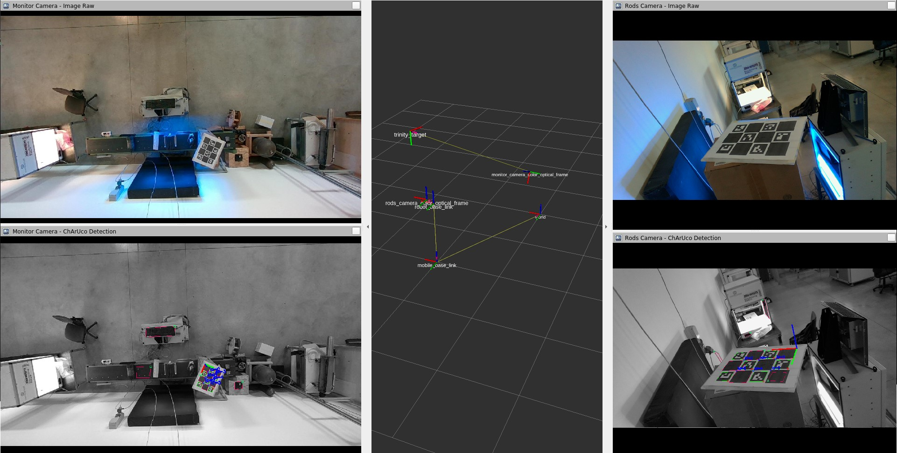

# DynCoMM - Cameras Calibration

## Overview

The trinity_calibration package is used to calibrate the position of the Monitor Camera in the [DynCoMM](https://dyncomm-project.eu/) open-call subproject of the EU-funded [Trinity](https://trinityrobotics.eu/) project.

### License

The source code is released under a [BSD 3-Clause license](LICENSE).

**Author: Gioele Vuaran<br />
Affiliation: [Video Systems S.R.L.](https://www.videosystems.it/en)<br />
Maintainer: Gioele Vuaran, g.vuaran@videosystems.it**

The trinity_calibration package has been tested under [ROS] Noetic on Ubuntu 20.04.
This is research code, expect that it changes often and any fitness for a particular purpose is disclaimed.





## Installation
### Building from Source
#### Dependencies

- [Robot Operating System (ROS)](http://wiki.ros.org) Noetic (middleware for robotics)
- [ChArUco Detector](https://github.com/VideoSystemsTech/charuco_detector)

#### Building

To build from source, clone the latest version from this repository into your catkin workspace and compile the package.
```bash
cd ~/catkin_ws/src
git clone https://github.com/VideoSystemsTech/charuco_detector
git clone https://github.com/VideoSystemsTech/trinity_calibration
cd ~/catkin_ws
catkin_make # or `catkin build`
```

## Usage

Print or buy a [ChArUco](https://docs.opencv.org/4.6.0/df/d4a/tutorial_charuco_detection.html) target of the appropriate size.

Start your robot pipeline, the two cameras and run this launch file:  
`roslaunch trinity_calibration cameras_positions_calibration.launch`

An [RViz] window starts up, showing:
* detection image of the ChArUco target from the Monitor Camera;
* detection image of the ChArUco target from the Rods Camera;
* TF tree.

When both cameras focus on the same ChArUco target, the TF tree is built, from the Monitor Camera all the way to the world frame.  
To read the pose of the Monitor Camera relative to the world frame, run:  
`rosrun tf tf_echo /world /monitor_camera_color_optical_frame`  

## Config files

config/

* **monitor_camera_params.yaml** [OpenCV Aruco Detector Parameters](https://docs.opencv.org/4.2.0/d1/dcd/structcv_1_1aruco_1_1DetectorParameters.html) for the Monitor Camera
* **rods_camera_params.yaml** [OpenCV Aruco Detector Parameters](https://docs.opencv.org/4.2.0/d1/dcd/structcv_1_1aruco_1_1DetectorParameters.html) for the Rods Camera

## Launch files

* **cameras_positions_calibration.launch**: starts the two cameras calibration software + RViz

    Calibration Target
     - **`squares_x`** number of chessboard squares in X direction. Default: `4`.
     - **`squares_y`** number of chessboard squares in Y direction. Default: `3`.
     - **`square_length`** chessboard square side length (meters). Default: `0.085`.
     - **`marker_length`** marker side length (meters). Default: `0.066`.
     - **`dictionary_id`** dictionary of markers indicating the type of markers ([source](https://docs.opencv.org/4.2.0/d9/d6a/group__aruco.html#gac84398a9ed9dd01306592dd616c2c975)). Default: `0`.

    #### Subscribed Topics

    * **`/monitor_camera/image_raw`** ([sensor_msgs/Image])

        The raw image from the Monitor Camera.

    * **`/monitor_camera/camera_info`** ([sensor_msgs/CameraInfo])

        The CameraInfo from the Monitor Camera.

## Bugs & Feature Requests

Please report bugs and request features using the [Issue Tracker](https://github.com/VideoSystemsTech/trinity_calibration/issues).

## Funding

[](https://ec.europa.eu/)

*DynCoMM Project* has received funding from the European Union's [Horizon 2020 research and innovation programme](https://ec.europa.eu/programmes/horizon2020/) under [grant agreement No 825196](https://cordis.europa.eu/project/id/825196)


[ROS]: http://www.ros.org
[RViz]: http://wiki.ros.org/rviz
[sensor_msgs/Image]: http://docs.ros.org/en/noetic/api/sensor_msgs/html/msg/Image.html
[sensor_msgs/CameraInfo]: http://docs.ros.org/en/noetic/api/sensor_msgs/html/msg/CameraInfo.html